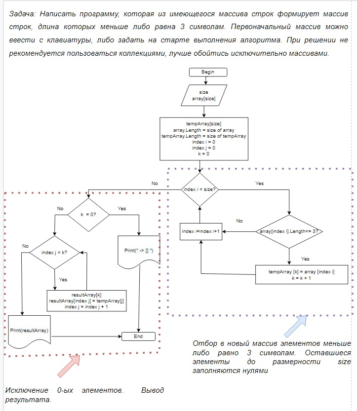

**Задание:** Написать программу, которая из имеющегося массива строк формирует массив из строк, длина которых меньше либо равна 3 символа. Первоначальный массив можно ввести с клавиатуры, либо задать на старте выполнения алгоритма. При решение не рекомендуется пользоваться коллекциями, лучше обойтись исключительно массивами.

Файл с блок-схемой решения задачи расположен в файле Flow–chart.jpg. 

Файл с кодом решения задачи на языке C# расположен в файле Program.cs.

В папке GeneralCase расположен файл с кодом обощенного решения, который формирует из введенного с клавиатуры массива новый массив типа string, длина строк которого меньше либо равно введенному числу number.

**Описание:** 
1)	На входе пользователь задает размер первоначального массива и вводит его элементы из консоли.
2)	Все элементы первоначального массива проверяются на соответствие критерию «длина строки меньше либо равна 3». Элементы, удовлетворяющие условию добавляются в новый промежуточный массив tempArray, при этом используем дополнительный счетчик k, который несет в себе две функции: позволяет последовательно заполнять новый массив и сообщает нам сколько элементов, удовлетворяющих условию на выходе у нас есть.
В результате данной операции получаем массив первые элементы которого заполнены строками из стартового массива, удовлетворяющими заданному критерию, оставшиеся элементы до размерности равной size нулями.
3)	Для того, чтобы убрать нулевые элементы проходим по  промежуточному массиву в цикле и добавляем k его элементов в результирующий массив размерности k.
4)	Если в первоначальном массиве нет ни одного элемента, удовлетворяющего заданному критерию, на печать в консоль выводим «[]».